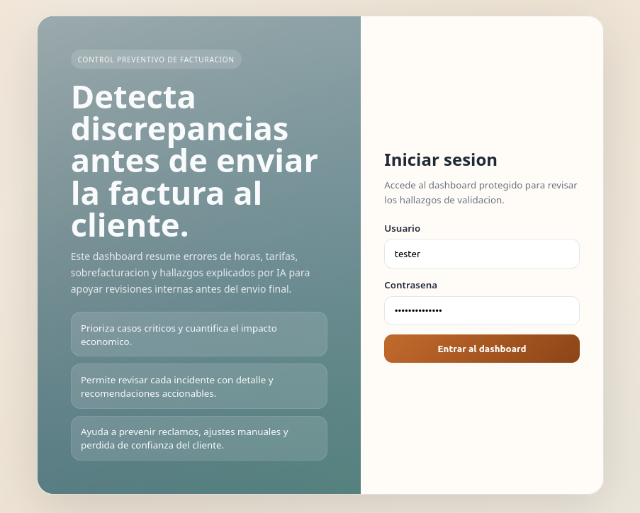
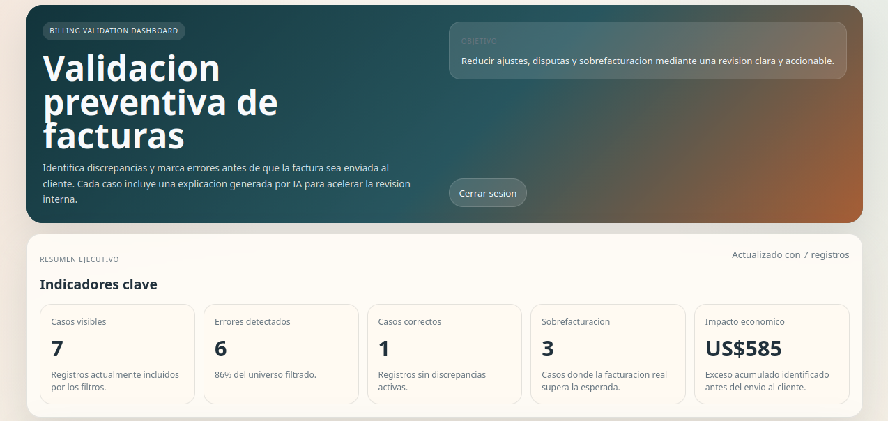
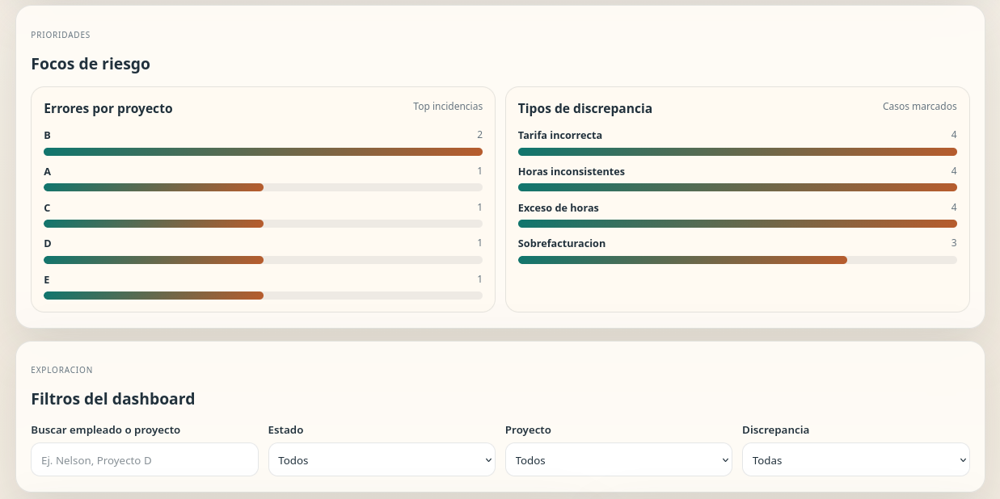
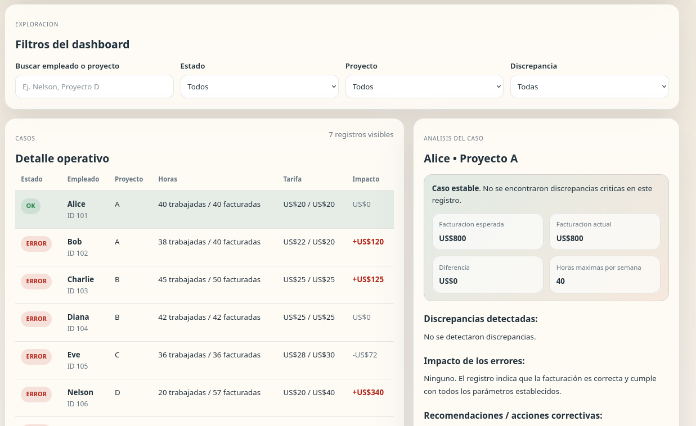

# Billing Validation Prototype Project.

The problem has differents datasets representing timesheets, contract rates, and billing reports. The task is to identify discrepancies and flag errors before invoices are sent to the client. 

An AI workflow will be implemented to explain the discrepancies found in the pipeline analysis. 

### Data description

- timesheet.csv → Contains employee hours worked per project
- contracts.csv → Contains contractual rates and max allowed hours
- billing.csv → Contains actual billed hours and rate

Use these datasets to identify discrepancies such as overbilling, rate mismatches, and contract violations

### Requirements.

1. Load and process input data (CSV or Excel)
2. Compare expected vs actual billing values
3. Identify discrepancies such as rate mismatches, missing hours, and overbilling
4. Generate a clean output dataset with flags (OK / ERROR)
5. Automate the workflow (Make.com or Python)
6. Use AI (OpenAI / Claude) to explain discrepancies and suggest corrective actions
7. Provide results via a simple interface (optional but recommended)
8. Deliver the solution via a structured GitHub repository

### Github Deliverables

1. Organized repository structure (data, scripts, prompts, workflows)
2. README file with clear explanation and instructions
3. Version control with meaningful commits


### Bonus Challenge

Design your solution so it can support multiple clients with different contract rules without requiring code changes

# Workflow run in a machine

Now the steps to run the project in any machine will be explained. 

1. To run the project in any machine the first thing to do is to create the environment for that project in python, this step depends in the OS that the project will be running. Also the file .env needs to be created and this depends of the environment

2. Install all the dependecies from the requirements.txt file.

```
pip install -r requirements.txt
```

3. Right now the test data of the project is in the folder src/data/input, but this can be change in any moment. 

4. Run the following command to generate the file src/data/input/billing_validation.json, that will store the analysis made for the pipeline. This file can be generated again with the following command:

```
python main.py
```

5. Run the dashboard in port 8000 with the following command:

```
python dashboard.py
``` 

6. To access to the dashboard with all the information about the analysis is neccesary to login with the user credentials. 

NOTE: There is also a DockerFile in the rootfolder, so you can create a container of the project if you want to. 

### Pictures of the project:

#### Login Page



#### KPI values and about info of the project



#### Stats of the errors



#### Detail page with the AI mardown analysis

